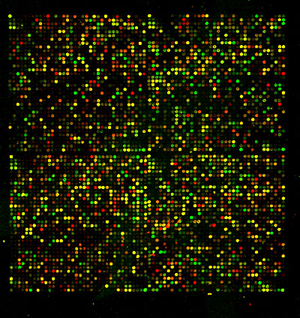
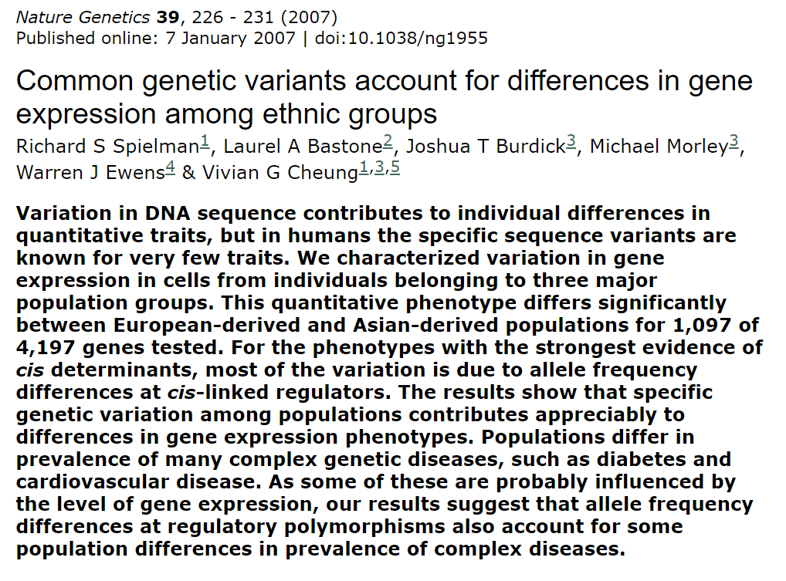
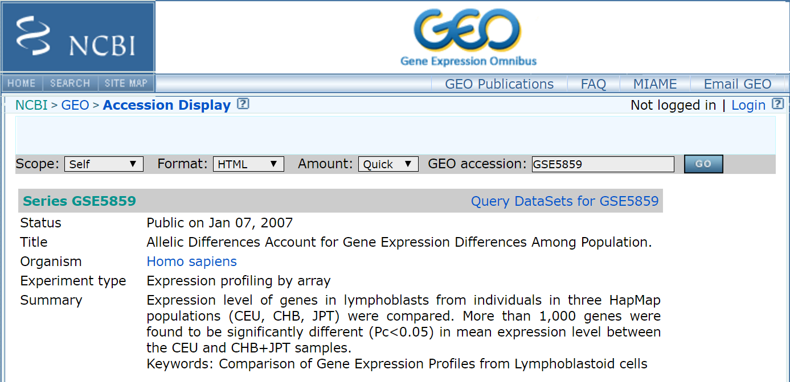

```{r,echo=F,message=FALSE,warning=FALSE,results='hide'}
# Call in the packages 
ll <- c('dplyr','magrittr','tidyr','ggplot2','cowplot','ggrepel','GGally','broom',
        'gridExtra','grid')
sapply(ll,function(l) require(l,character.only = T))

# Load in our data
setwd('C:/Users/erikinwest/Documents/Courses/EPID_823/presentation/')
load('rmd_data.RData')

# Call in general support functions
source('C:/Users/erikinwest/Documents/R/funzies.R')
```

## Background: the central dogma of biology

* The full map of our species $\approx$ 20K genes was determined in 2003 with the completion of the Human Genome Project.
* DNA is a double-stranded discrete sequence of base pairs, with each codon (triplet) of base pairs mapping to one of 20 **amino acids** which chain together to form **proteins**. 
* While each cell in your body contains an identical **genome** (complete set of genes), they differ in **expression** because of **epigenetic** factors.
* The *central dogma* of biology is: **DNA** maps to **messenger RNA** which builds **proteins**.
* DNA Microarrays let us compare the gene expression levels (for thousands of genes simultaneously) between different cells in the same person (liver vs. skin) or between the same cell in different people (female vs. male) or disease status (cancer vs. non-cancer).

## How do microarrays work?

* From a given cell we can extract the frequency of messenger RNA, convert it to complementary DNA (cDNA) and then make millions of copies using a polymerase chain reaction.  
* Each microarray is segmented into small squares which each contain thousands of identical **oligonucleotides** which will **hybridize** (bind) to specific sequences known to map to certain genes.
* By tagging the cDNA with fluorescent dyes we can determine the intensity of gene expression.


<figure>
  
  <figcaption> <font size="2"><i>Microarray under the microscope</i></font> 
  </figcaption>
</figure>

## What are batch effects?

* Hybridization intensities are always normalized within each microarray.
* However, **batch effects** are any artifacts (i.e. non-biological sources of variation) that remain after normalization.
* Common reasons for batch effects include:
    + Magnitude of chemical reagents used on plates
    + Time of day when the assay is done
    + Temperature in lab
* Batch effects lead to either:
    + Increased noise (best case scenario)
    + Spurious results (worst case scenario, i.e. when correlated with biological controls)

# Section 1: The Spielman *et al.* slipup

## "This phenotype differs significantly between European and Asian populations..."

This article [@spielman_2007] has been cited as a paper that failed to adjust for batch effects [@dafls_2015].



## Modern genomics research data can be found at the NCBI's Gene Expression Omnibus (GEO)



## Chart 1: Spurious findings

```{r,echo=F}
rmd.list$agg1 %>% plot_grid
```

# Section 2: How to spot a batch effect

## Section 2: How to spot a batch effect

* Monte Carlo simulations: check if random sub-samples of the biological control are normally distributed.
* Multidimensional scaling (MDS) and linear classification: compare the classification rules of a Support Vector Machine (SVM) with a linear kernel for data labelled biological and non-biological.
* Principal Component (PC) Analysis: see if the primary sources of *supposed* biological variation are randomly distributed with respect to non-biological factors.
* Genetic heatmaps: would hierarchical clustering be able to separate biological and non-biological variation?

## Chart 2: How to spot a batch effect

```{r,echo=F}
rmd.list$agg2 %>% plot_grid
```

# Section 3: Combating batch effects with ComBat

## Section 3: Combating batch effects with ComBat

* Uses an Empirical Bayes (EB) approach to adjust for known batch effects [@li_2006].
* Robust to small batch-sample observations (our batches range from 2-23 people).
* Pools information across genes with Bayesian hierarchical modelling.
* Assumes that $G_{b,j,g}\sim N(\gamma_{b,g},\sigma^2_{b,g})$ for batch $b$, with hierarchical priors $\gamma_{b,g}\sim N(Y_b,\tau^2_b)$ and $\sigma^2_{b,g}\sim IG(\lambda_b,\theta_b)$ which are estimated empirically.
* EB adjusted data: $G_{b,i,j}^*=\hat{\delta}_g/\hat{\sigma}_g(G_{b,i,j}-\hat{\gamma}_{b,g})+\hat{\alpha}_g$ where $\hat{\delta}_g$ and $\hat{\alpha}_g$ are the mean and standard error calculated during normalization, and $^*$ denotes the posterior estimate.

## Section 3: Combating batch effects with ComBat

* After adjusting our data we see that the statistically signficant differences between ethnicities are gone.
* Note: while ComBat is considered the one of the best adjustment methods [@chen_2011], it will inevitably lose some biological information.

```{r,echo=F,fig.height=4,fig.align='center',fig.width=10}
rmd.list$agg5
```

## References and Replication

* Code to replicate this presentation can be found [here](https://github.com/ErikinBC/BatchEffects).

<!-- # Section 2: How to Find Batch Effects Ex Ante? -->

<!-- ## Heatmap by Biological and Other Factors -->

<!-- ```{r,echo=F} -->
<!-- rmd.list$gg.heat.grid %>% plot_grid -->
<!-- ``` -->

<!-- ## Chart 3: PCA Correlation -->

<!-- ```{r,echo=F} -->
<!-- rmd.list$gg.datemon.pc -->
<!-- ``` -->

<!-- ## Chart 4: PCA Analysis/MDS  -->

<!-- ```{r,echo=F} -->
<!-- rmd.list$agg3 -->
<!-- ``` -->

<!-- # Section 3: Two Methods for Adjusting for Known Batch Effects -->

<!-- ## Linear Contrasts -->

<!-- * Use linear contrasts and adjust, where $G_{j,g}$ is the gene expression levels for person $j$ on gene $g$, with $k+1$ known batches, and $k$ contrasts.  -->
<!-- * By having our contrast design matrix columns which sum to one and be orthogonal to each other, the sum of the $\theta$'s is equal to zero and our coefficients represent mean differences **relative** to a given group.  -->

<!-- $$G_{j,g} = \theta_{1,g}a_1 + \dots + \theta_{k,g}a_k + e_{j,g}$$ -->

<!-- * Equivalent to running regression on each gene. -->

<!-- ## Linear Contrasts -->

<!-- * After using this method we find **no difference in gene expression between ethnicities**. -->
<!-- * However we may have removed too much inter-group variation... -->

<!-- *And then there were none...* -->
<!-- ```{r,echo=F,fig.height=4,fig.align='center',fig.width=10} -->
<!-- rmd.list$agg4 -->
<!-- ``` -->

